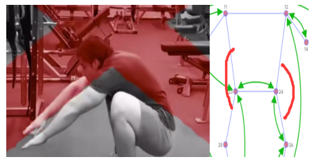

# 人体特征点与行为识别算法
## 深蹲计数
* 详见`/深蹲检测`
## demo1 深蹲打分

* **实现对单人连续深蹲进行打分**
* 设置一个标准的动作序列模板,通过DTW得相似度(即得分)
* 数据是由一段连续深蹲视频通过`mediapipe`关键点检测, 测得指定的几个需要评测的关节点角度
  * 详情见`深蹲检测/文档.docx`
* 原视频在`/data/share/vedio1_copy.mp4`
* 角度计算方式通过余弦公式
* 为了方便,实验只用到了角度A,实际运用应该把需要的角度分别计算,再加权平均
  * 

## 持续更新ing